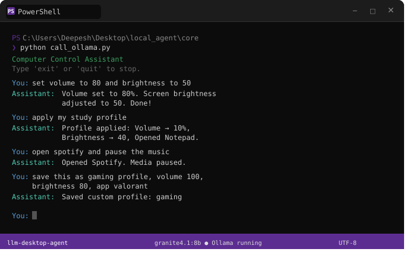

# 🖥️ llm-desktop-agent

> Control your Windows PC using natural language — powered entirely by local LLMs. No cloud. No API keys. No subscriptions.


---



## What is this?

`llm-desktop-agent` is a fully local AI agent that lets you control your Windows machine through natural language. Ask it to adjust your volume, change screen brightness, open apps, manage profiles, or chain multiple actions together — all without touching the cloud.

It uses [Ollama](https://ollama.com) to run LLMs locally on your hardware and [LangChain](https://langchain.com) to give the model real tools it can act on.

```
You: apply my study profile
Assistant: Volume → 10%, Brightness → 40, Opened Notepad. Done!

You: set volume to 80, open spotify and pause the music
Assistant: Volume set to 80%. Opened Spotify. Media paused.

You: save this as gaming profile, volume 100, brightness 80, app valorant
Assistant: Saved custom profile: gaming
```

---

## Features

- **Volume control** — get and set system volume, mute/unmute
- **Screen brightness** — read and adjust display brightness
- **Media control** — play/pause media globally across any app
- **App launcher** — open any installed application by name, with fuzzy matching
- **Window management** — set any running app as the active foreground window
- **Profile system** — save, load, and delete named configuration profiles (e.g. "study", "gaming")
- **Multi-step reasoning** — one request can chain multiple tools automatically
- **Persistent conversation** — remembers context within a session
- **100% local** — everything runs on your machine, nothing leaves it

---

## Tech Stack

| Tool | Role |
|---|---|
| [Ollama](https://ollama.com) | Local LLM inference runtime |
| [LangChain](https://python.langchain.com) | Agent framework and tool orchestration |
| [pycaw](https://github.com/AndreMiras/pycaw) | Windows audio control via COM API |
| [screen-brightness-control](https://github.com/Crozzers/screen-brightness-control) | Display brightness management |
| [pyautogui](https://pyautogui.readthedocs.io) | Global media key simulation |
| [pygetwindow](https://github.com/asweigart/PyGetWindow) | Window focus and management |
| [pywin32](https://github.com/mhammond/pywin32) | Windows API access and `.lnk` resolution |
| [comtypes](https://github.com/enthought/comtypes) | COM interface bindings for audio |

Every single dependency is free and open source.

---

## Requirements

- Windows 10 or 11
- Python 3.10+
- [Ollama](https://ollama.com/download) installed and running
- A GPU is recommended (tested on RTX 4060 8GB) but not required

### Recommended Models

| Model | VRAM | Tool Calling |
|---|---|---|
| `qwen2.5:3b` | ~2.5GB | Decent |
| `granite4.1:8b` | ~5GB | Good |
| `qwen2.5:7b` | ~5GB | Very Good |
| `mistral:7b` | ~4.5GB | Good |

---

## Installation

```bash
# 1. Clone the repository
git clone https://github.com/DeepeshAlwani/llm-desktop-agent.git
cd llm-desktop-agent

# 2. Create and activate a virtual environment
python -m venv agent_env
agent_env\Scripts\activate

# 3. Install dependencies
pip install -r requirements.txt

# 4. Pull a model via Ollama
ollama pull granite4.1:8b

# 5. Run the agent
cd core
python call_ollama.py
```

---

## Project Structure

```
llm-desktop-agent/
├── core/
│   ├── call_ollama.py      # Agent loop and conversation management
│   └── tools.py            # All LangChain tools (volume, brightness, apps, profiles)
├── profiles/               # Saved user profiles (auto-created on first save)
├── requirements.txt
└── README.md
```

The architecture is intentionally separated so a GUI layer can be dropped in later without touching the agent logic.

---

## How It Works

```
User input (terminal)
        ↓
   LangChain Agent
   + tool definitions
        ↓
   LLM decides which tool(s) to call
        ↓
   Python dispatcher executes:
   pycaw / pyautogui / subprocess / sbc
        ↓
   Result returned to LLM
        ↓
   Natural language response to user
```

The LLM never directly touches your system. It outputs structured tool calls, and Python executes them. This means you can inspect, restrict, or extend every action the agent can take.

---

## Profiles

Profiles let you save named configurations and apply them with a single command.

```
You: save a profile called focus — volume 20, brightness 35, app notepad
You: apply my focus profile
You: what profiles do I have?
You: delete the gaming profile
```

Profiles are stored as plain JSON in the `profiles/` folder — human-readable and editable by hand if needed.

---

## Roadmap

The following features are planned. Contributions welcome on any of these.

### Near Term
- [ ] Memory between sessions (SQLite-backed conversation history)
- [ ] `get_` counterparts for all tools (current power plan, running processes, etc.)
- [ ] Night light toggle via Windows registry
- [ ] Resolution switching
- [ ] System shutdown / restart / sleep commands

### Medium Term
- [ ] Scheduled actions ("mute at 11pm every night") via APScheduler
- [ ] Voice input via `faster-whisper` for hands-free control
- [ ] "Restore previous state" — snapshot system state before profile apply
- [ ] Multi-monitor brightness support

### Long Term
- [ ] Native Windows GUI using PySide6 (no Electron, no web wrapper)
- [ ] LangGraph-based agent for more complex multi-step planning
- [ ] Plugin system so users can add their own tools without modifying core files
- [ ] Auto-discovery of user preferences over time

---

## Contributing

Contributions are very welcome. Here is how it works:

### Getting Started

1. Fork the repository
2. Create a feature branch: `git checkout -b feature/your-feature-name`
3. Make your changes
4. Test on a Windows machine (the project is Windows-only by design)
5. Open a pull request with a clear description of what you added and why

### What to Contribute

Good places to start:

- **New tools** — anything you can control via Python on Windows is fair game. Add it in `tools.py` with the `@tool` decorator and a clear docstring.
- **Bug fixes** — especially around edge cases in app launching or COM audio handling
- **Model testing** — if you've tested a model not in the recommended list, open a PR updating the table
- **Documentation** — if something is unclear, fix it

### Guidelines

- Keep tools focused — one tool should do one thing well
- Always handle exceptions and return a string describing what went wrong (the LLM needs to read the error)
- Test your tool both standalone and through the agent before submitting
- Follow the existing code style — plain Python, no unnecessary abstractions

### Issues

Found a bug? Open an issue with your OS version, Python version, Ollama model, and the exact error message. The more detail, the faster it gets fixed.

---

## Acknowledgements & Shoutouts

This project stands on the shoulders of some excellent open source work:

- **[Ollama](https://ollama.com)** — for making local LLM inference genuinely easy. Without this, the whole project requires a cloud dependency.
- **[LangChain](https://python.langchain.com)** — the agent framework that handles tool calling, conversation memory, and the glue between the LLM and Python functions.
- **[pycaw](https://github.com/AndreMiras/pycaw)** — the only sane way to control Windows audio from Python. Solid library.
- **[screen-brightness-control](https://github.com/Crozzers/screen-brightness-control)** — handles the messy DDC/CI and WMI layers so you don't have to.
- **[pyautogui](https://pyautogui.readthedocs.io)** — for global media key simulation that actually works.
- **[pygetwindow](https://github.com/asweigart/PyGetWindow)** — simple and effective window management.
- **[pywin32](https://github.com/mhammond/pywin32)** — the backbone for any serious Windows API work in Python.

---

## A Note on This README

This README was written with the assistance of an LLM (Claude by Anthropic), used as a research and writing partner during development. The project itself, the architecture decisions, the tool implementations, and the debugging were all done by the developer — the LLM helped articulate and structure the documentation. This is itself a demonstration of what thoughtful human + LLM collaboration looks like in a real project.

---

## License

MIT License — free to use, modify, and distribute. See `LICENSE` for details.

---

*Built on Windows. Runs locally. No cloud required.*