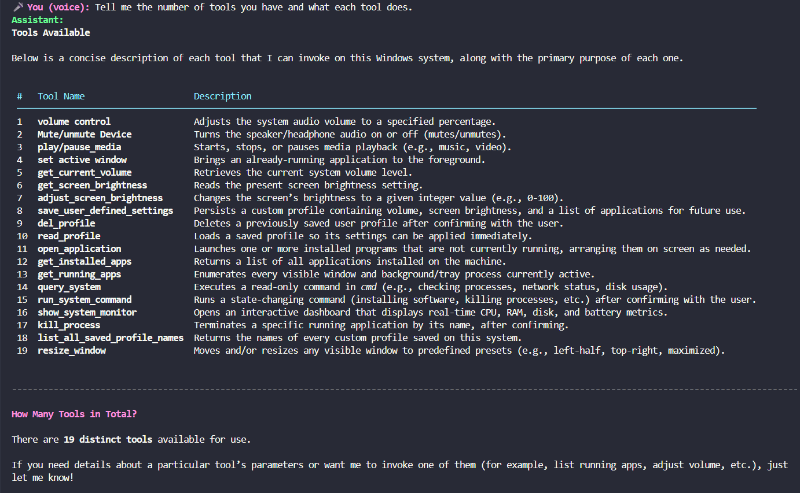

# 🖥️ llm-desktop-agent

> Control your Windows PC using natural language — powered entirely by local LLMs. No cloud. No API keys. No subscriptions.


---



---

## What is this?

`llm-desktop-agent` is a fully local AI agent that lets you control your Windows machine through natural language. Ask it to adjust your volume, change screen brightness, open apps, manage profiles, close processes, query system info, or chain multiple actions together — all without touching the cloud.

It uses [Ollama](https://ollama.com) to run LLMs locally on your hardware and [LangChain](https://langchain.com) to give the model real tools it can act on. The terminal interface is built with [Rich](https://github.com/Textualize/rich) for clean formatted output, and a live system monitor is available via [Textual](https://github.com/Textualize/textual).

```
You: apply my gaming profile
Assistant: Volume → 100%, Brightness → 80. Opened Valorant and Chrome (YouTube). Windows arranged side by side.

You: what is eating my RAM right now?
Assistant: Top memory consumers: chrome.exe (892 MB), ollama.exe (4.1 GB), discord.exe (412 MB)...

You: close whatsapp its not needed
Assistant: Found WhatsApp running in background. Closing it now... Done.

You: open chrome with youtube and google docs side by side
Assistant: Opened chrome (youtube.com) and chrome (docs.google.com). Arranged side by side.

You: move chrome to the left half and snap notepad to the right
Assistant: Moved Chrome to left-half. Moved Notepad to right-half.
```

---

## Features

### System Control
- **Volume** — get and set system volume, mute/unmute with auto-unmute on volume change (setting volume while muted automatically unmutes)
- **Screen brightness** — read and adjust display brightness
- **Media control** — play/pause media globally across any app via virtual media keys
- **App launcher** — open any installed application by name with fuzzy matching; sources Start Menu shortcuts, registry, and Windows built-ins (notepad, calc, mspaint, etc.), supports URLs for browser apps
- **Multi-app launch** — open multiple apps at once with automatic window arrangement: 1-app fullscreen, 2-app side-by-side, 3-app main+stack, 4-app grid
- **Window management** — bring any running app to the foreground; distinguishes visible windows from tray/background processes
- **Window resize & reposition** — move and resize any window by name using named presets or exact percentages (see below)
- **Process management** — close any running application including system tray apps, with fuzzy process name matching; uses `taskkill /T` to terminate full process trees including Store/AppContainer apps

### Window Layout Presets

Say things like _"move chrome to the left half"_, _"snap notepad to the top right"_, _"put spotify in the center third"_ — the agent maps natural language to one of 15 named presets:

| Preset | Description |
|---|---|
| `left-half` / `right-half` | Fill left or right 50% |
| `top-half` / `bottom-half` | Fill top or bottom 50% |
| `top-left` / `top-right` / `bottom-left` / `bottom-right` | Quarter-screen corners |
| `left-third` / `center-third` / `right-third` | Horizontal thirds |
| `left-two-thirds` / `right-two-thirds` | Two-thirds layouts |
| `maximized` | Full screen |
| `centered` | Floating centered (50% wide, 80% tall) |

Custom pixel-exact placement is also supported via x/y/width/height percentages.

### Intelligence
- **Profile system** — save and load named configurations with multiple apps, optional URLs per app, volume and brightness (e.g. "study", "gaming", "focus")
- **Multi-step reasoning** — one request chains multiple tools automatically
- **System awareness** — checks if apps are already running before opening, detects tray vs visible windows, verifies actions with follow-up tool calls
- **CMD access** — controlled read/write access to Windows command line split into two tools: read-only queries (`query_system`) and state-changing commands (`run_system_command`) with mandatory user confirmation
- **Command safety layer** — blocklist of destructive operations (`del`, `format`, `reg delete`, `diskpart`, symlink creation, script file writes, etc.) refused regardless of how they're requested; separate confirmation gate for shutdown, restart, `winget install/uninstall`, and network changes
- **Persistent conversation** — remembers context within a session

### Monitoring
- **Live system dashboard** — real-time terminal UI showing CPU, RAM, GPU, GPU VRAM, disk read/write MB/s, battery status and time remaining
- **Process table** — top 30 processes sorted by CPU with colour-coded usage (red >50%, yellow >20%)
- **Sparkline history** — rolling 40-sample graphs for each metric updating every 2 seconds
- **System info queries** — ask in natural language about network, disk, installed software, running processes

### Interface
- **Voice input** — hold `Shift+V` to speak, release to send; transcribed entirely locally via faster-whisper (base model, CPU, int8 quantized); no audio ever leaves the machine; Whisper model loads lazily on first use so startup is instant
- **Unified input queue** — voice and keyboard both feed the same queue so transcripts are dispatched immediately without pressing Enter
- **Rich terminal output** — markdown rendering, tables, panels, syntax highlighting
- **Thinking spinner** — visual feedback while agent is processing
- **Smart rendering** — auto-detects JSON, markdown tables, bullet lists and renders each appropriately
- **Graceful degradation** — voice dependencies (faster-whisper, sounddevice, keyboard) are optional; agent runs normally in text-only mode if they are not installed
- **100% local** — nothing leaves your machine

---

## Tech Stack

| Tool | Role |
|---|---|
| [Ollama](https://ollama.com) | Local LLM inference runtime |
| [LangChain](https://python.langchain.com) | Agent framework and tool orchestration |
| [Rich](https://github.com/Textualize/rich) | Terminal formatting, markdown, tables |
| [Textual](https://github.com/Textualize/textual) | Interactive live system monitor TUI |
| [psutil](https://github.com/giampaolo/psutil) | Cross-platform process and system utilities |
| [GPUtil](https://github.com/anderskm/gputil) | NVIDIA GPU usage and VRAM monitoring |
| [pycaw](https://github.com/AndreMiras/pycaw) | Windows audio control via COM API |
| [screen-brightness-control](https://github.com/Crozzers/screen-brightness-control) | Display brightness management |
| [pyautogui](https://pyautogui.readthedocs.io) | Global media key simulation |
| [pygetwindow](https://github.com/asweigart/PyGetWindow) | Window focus and management |
| [pywin32](https://github.com/mhammond/pywin32) | Windows API access, `.lnk` shortcut resolution, low-level window positioning |
| [comtypes](https://github.com/enthought/comtypes) | COM interface bindings for audio |
| [faster-whisper](https://github.com/SYSTRAN/faster-whisper) | Local speech-to-text transcription (optional) |
| [sounddevice](https://python-sounddevice.readthedocs.io) | Microphone audio capture (optional) |
| [keyboard](https://github.com/boppreh/keyboard) | Global hotkey detection for push-to-talk (optional) |

Every single dependency is free and open source.

---

## Requirements

- Windows 10 or 11
- Python 3.12.4+
- [Ollama](https://ollama.com/download) installed and running
- A GPU is recommended (tested on RTX 4060 8GB with NVIDIA) but not required
- For GPU monitoring: NVIDIA GPU with drivers installed (AMD GPU monitoring not currently supported)

### Recommended Models

| Model | VRAM | Tool Calling | Notes |
|---|---|---|---|
| `qwen2.5:3b` | ~2.5GB | Decent | Lightweight, fast |
| `granite4.1:8b` | ~5GB | Good | Tested model for this project |
| `qwen2.5:7b` | ~5GB | Very Good | Best balance |
| `mistral:7b` | ~4.5GB | Good | Strong reasoning |

---

## Installation

```bash
# 1. Clone the repository
git clone https://github.com/DeepeshAlwani/llm-desktop-agent.git
cd llm-desktop-agent

# 2. Create and activate a virtual environment
python -m venv agent_env
agent_env\Scripts\activate

# 3. Install dependencies
pip install -r requirements.txt

# 4. (Optional) Install voice input dependencies
pip install faster-whisper sounddevice keyboard numpy

# 5. Pull a model via Ollama
ollama pull granite4.1:8b

# 6. Run the agent
cd core
python call_ollama.py
```

> **Note:** Run from Windows Terminal (not VS Code's integrated terminal) for best results. The live system monitor spawns a new terminal window and requires full TTY support.

---

## Voice Input

Hold `Shift+V` to record, release to send. The transcript is injected directly into the agent — no Enter key needed.

- Runs entirely on CPU using faster-whisper's `base` model with int8 quantization
- The Whisper model downloads and loads on first use (~150MB, cached afterwards)
- Change the hotkey by editing `VOICE_HOTKEY` at the top of `call_ollama.py`
- Change the model size (`tiny` / `base` / `small`) by editing `WHISPER_MODEL_SIZE` — `base` is the recommended balance of speed and accuracy for commands
- Voice is optional — if the packages aren't installed the agent runs in text-only mode with no errors

---

## Project Structure

```
llm-desktop-agent/
├── core/
│   ├── call_ollama.py      # Agent loop, conversation management, Rich rendering, voice input
│   ├── tools.py            # All LangChain tools (19 tools)
│   └── dashboard.py        # Textual live system monitor (launched separately)
├── profiles/               # Saved user profiles — auto-created on first save
├── assets/
│   └── preview.png         # Terminal screenshot for README
├── requirements.txt
└── README.md
```

The agent logic, tool definitions, and interface are kept intentionally separate so a GUI layer can be dropped in later without touching the core.

---

## How It Works

```
User input (typed or voice)
        ↓
   Unified input queue
   (keyboard thread + voice thread)
        ↓
   LangChain Agent
   + 19 tool definitions
        ↓
   LLM decides which tool(s) to call and in what order
        ↓
   Python dispatcher executes:
   pycaw / pyautogui / subprocess / sbc / psutil / win32api / win32gui
        ↓
   Tool result returned to LLM
        ↓
   Rich-formatted response to user
```

The LLM never directly touches your system. It outputs structured tool calls, and Python executes them. Every action is inspectable, restrictable, and extensible.

---

## Profiles

Profiles let you save named configurations and apply them with a single command. Each profile supports multiple apps, optional URLs per app, volume and brightness.

```
You: save a profile — chrome with youtube, notepad, volume 20, brightness 40, call it study
You: apply my study profile
You: what profiles do I have?
You: delete the gaming profile
```

Profile JSON structure:

```json
{
    "apps": [
        {"name": "chrome", "url": "https://youtube.com"},
        {"name": "notepad", "url": null}
    ],
    "screen_brightness": 40,
    "volume_level": 20
}
```

Profiles are stored as plain JSON in `profiles/` — human-readable and editable by hand.

---

## CMD Access

The agent has controlled access to the Windows command line split into two tools:

- **`query_system`** — read-only queries: `ipconfig`, `tasklist`, `netstat`, `systeminfo`, `winget list`, `ping` etc.
- **`run_system_command`** — state-changing actions: `taskkill`, `winget install`, `netsh`, power commands — always with user confirmation

Destructive commands (`del`, `format`, `reg delete`, `diskpart`, symlink creation, script file writes, etc.) are blocked regardless of how they are requested.

---

## System Monitor

Launch the live dashboard by asking the agent or running directly:

```bash
python dashboard.py
```

| Metric | Details |
|---|---|
| CPU % | Overall usage with sparkline history |
| RAM % | Memory usage with sparkline history |
| GPU % | NVIDIA GPU load (requires GPUtil) |
| GPU RAM % | VRAM usage percentage |
| Disk Read/Write | Real MB/s delta (not cumulative), updated every 2s |
| Battery | Percentage, plug status, time remaining |
| Process table | Top 30 by CPU — colour coded red >50% / yellow >20% |

Keyboard shortcuts: `q` quit, `r` refresh processes, `d` toggle dark/light theme.

---

## Roadmap

### Near Term
- [ ] Memory between sessions (SQLite-backed conversation history)
- [ ] Night light toggle via Windows registry
- [ ] Resolution switching
- [ ] System shutdown / restart / sleep commands
- [ ] WhatsApp and other UWP app process name alias map
- [ ] Wake word detection so voice activates hands-free (no hotkey hold)
- [ ] Voice feedback — TTS responses so the agent speaks back
- [ ] Per-app volume control (set Spotify to 40% without touching system volume)

### Medium Term
- [ ] Scheduled actions ("mute at 11pm every night") via APScheduler
- [ ] Snapshot and restore system state before profile apply
- [ ] Multi-monitor support — specify which display to move a window to
- [ ] Multi-monitor brightness — set brightness per display independently
- [ ] AMD GPU monitoring support
- [ ] Clipboard read/write — "copy this text to my clipboard" or "what's in my clipboard"

### Long Term
- [ ] Native Windows GUI using PySide6 (no Electron, no web wrapper)
- [ ] LangGraph-based agent for more complex multi-step planning
- [ ] Plugin system so users can add tools without modifying core files
- [ ] Auto-discovery of user preferences over time

---

## Contributing

Contributions are very welcome.

### Getting Started

1. Fork the repository
2. Create a feature branch: `git checkout -b feature/your-feature-name`
3. Make your changes
4. Test on a Windows machine — this project is Windows-only by design
5. Open a pull request with a clear description of what you added and why

### What to Contribute

- **New tools** — anything controllable via Python on Windows. Add in `tools.py` with the `@tool` decorator and a clear docstring.
- **Bug fixes** — especially around app launching, process detection, or COM audio edge cases
- **Model testing** — tested a model not in the recommended list? Open a PR updating the table
- **App aliases** — know the real process name for a common app? Add it to `APP_ALIASES` in `tools.py`
- **Documentation** — if something is unclear, fix it

### Guidelines

- Keep tools focused — one tool does one thing well
- Always handle exceptions and return a descriptive string — the LLM reads the error
- Test your tool standalone before wiring it into the agent
- Follow the existing code style — plain Python, no unnecessary abstractions

### Issues

Open an issue with: OS version, Python version, Ollama model name, and the exact error or unexpected behaviour. The more detail, the faster it gets resolved.

---

## Acknowledgements & Shoutouts

- **[Ollama](https://ollama.com)** — for making local LLM inference genuinely easy. Without this the whole project requires a cloud dependency.
- **[LangChain](https://python.langchain.com)** — the agent framework handling tool calling, conversation state, and the glue between the LLM and Python.
- **[Rich](https://github.com/Textualize/rich)** and **[Textual](https://github.com/Textualize/textual)** — for making terminal output actually look good.
- **[pycaw](https://github.com/AndreMiras/pycaw)** — the only sane way to control Windows audio from Python.
- **[screen-brightness-control](https://github.com/Crozzers/screen-brightness-control)** — handles the messy DDC/CI and WMI layers so you don't have to.
- **[psutil](https://github.com/giampaolo/psutil)** — reliable cross-platform process and system metrics.
- **[faster-whisper](https://github.com/SYSTRAN/faster-whisper)** — CTranslate2-based Whisper that runs comfortably on CPU with int8 quantization.
- **[pyautogui](https://pyautogui.readthedocs.io)** — global media key simulation that actually works.
- **[pygetwindow](https://github.com/asweigart/PyGetWindow)** — simple and effective window management.
- **[pywin32](https://github.com/mhammond/pywin32)** — the backbone for any serious Windows API work in Python.

---

## A Note on This README

This README was written with the assistance of Claude (Anthropic), used as a research and writing partner throughout development. The project itself — the architecture decisions, tool implementations, debugging, and design — was done by the developer. The LLM helped articulate, structure, and document it. This is itself a demonstration of what thoughtful human + LLM collaboration looks like in a real project.

---

## License

MIT License — free to use, modify, and distribute. See `LICENSE` for details.

---

*Built on Windows. Runs locally. No cloud required.*